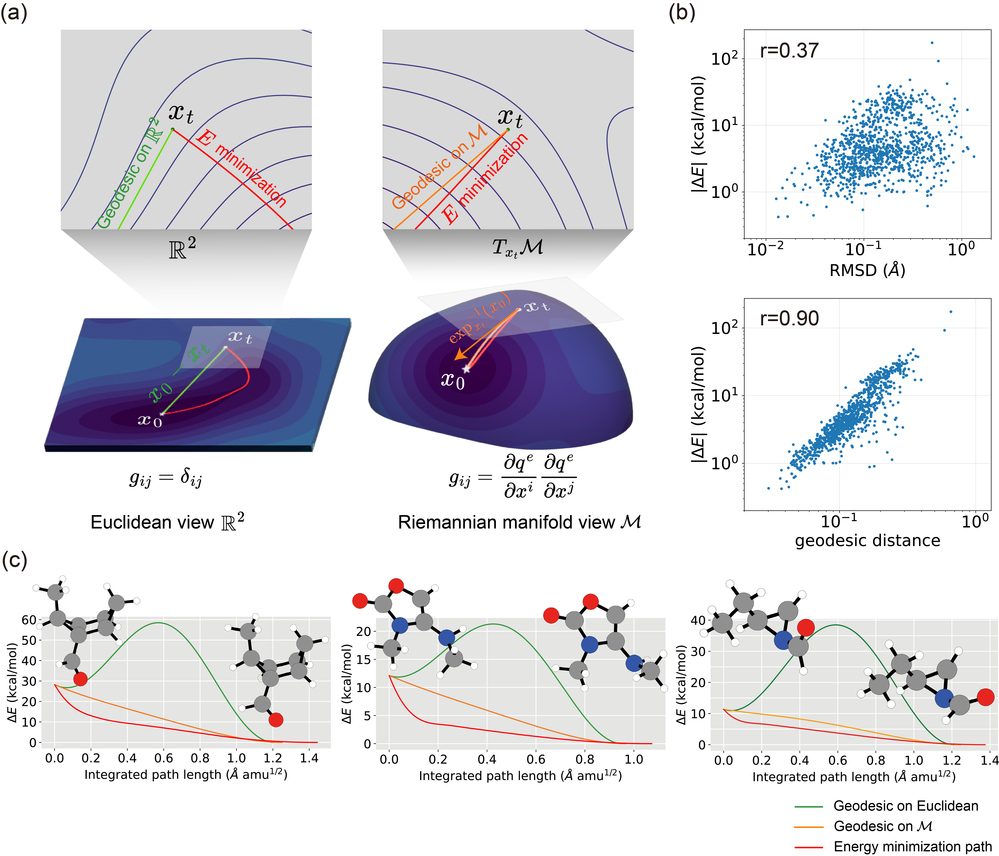

# Riemannian Denoising Score Matching (R-DSM) for Molecular Optimization with Chemical Accuracy

[](https://github.com/seonghann/neural_opt/tree/refactoring/LICENSE)

Refer the paper, **"Riemannian Denoising Score Matching for Molecular Optimization with Chemical Accuracy"**.
[[arXiv]](https://arxiv.org/abs/2411.19769)



---

## Environments

### Install via Conda (Recommended)

To set up the environment, use the following commands:

```bash
conda create -n neural_opt_reproduce python=3.9.16 pytorch==2.0.1 pytorch-cuda=11.7 -c pytorch -c nvidia
pip install torch-geometric==2.3.1 torch-scatter==2.1.2+pt20cu117 torch-cluster==1.6.3+pt20cu117 torch-sparse==0.6.18+pt20cu117 pytorch-lightning==2.1.3 -f https://data.pyg.org/whl/torch-2.0.0+cu117.html
pip install matplotlib pandas==2.0.3
python setup.py develop
```

---

## Dataset

Details will be provided soon.


## Training

Hyperparameters and training configurations are specified in the YAML files located in `./configs/`.

```bash
# Pretraining R-DSM with Euclidean noise-sampling
python main.py configs/training.qm9.rdsm.yaml
# Fine-tuning R-DSM with Riemannian noise-sampling
python main.py configs/finetuning.qm9.rdsm.yaml
```

---

## Sampling

Checkpoints for models trained on the QM9 and GEOM-QM9 datasets are available in `./checkpoints/*.ckpt`.

To reproduce the results from the paper:


```bash
# Sampling (generates 'save_dynamic.qm9.rdsm.finetuned.pt')
python main.py configs/sampling.qm9.rdsm.yaml
# Performance evaluation (calculates RMSD, D-MAE, etc.)
python evaluate_accuracy.py \
  --config_yaml configs/sampling.qm9.rdsm.yaml \
  --prb_pt save_dynamic.qm9.rdsm.finetuned.pt \
  --ban_index /home/share/DATA/QM9M/wrong_samples.pkl
```

---

## Citation

Please consider citing the our paper if you find it helpful. Thank you!

```
@article{woo2024riemannian,
  title={Riemannian Denoising Score Matching for Molecular Structure Optimization with Accurate Energy},
  author={Woo, Jeheon and Kim, Seonghwan and Kim, Jun Hyeong and Kim, Woo Youn},
  journal={arXiv preprint arXiv:2411.19769},
  year={2024}
}
```

