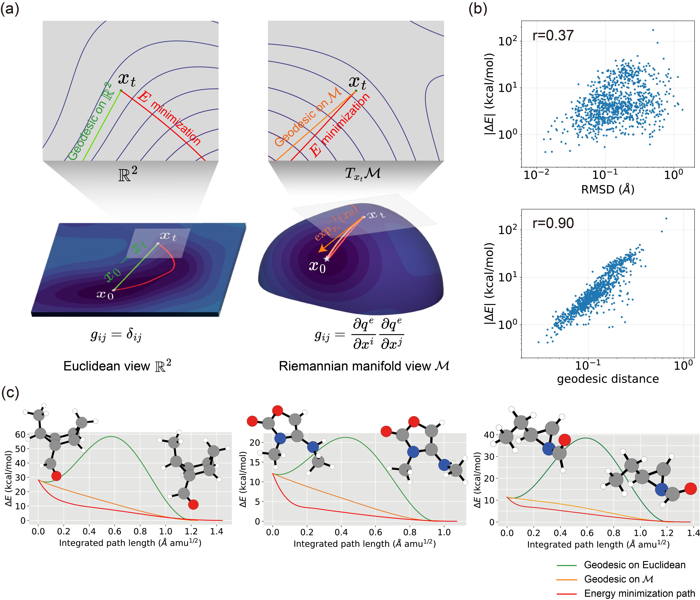

# Riemannian Denoising Score Matching for Molecular Structure Optimization

[](https://github.com/seonghann/neural_opt/blob/refactoring/LICENSE)
[](https://arxiv.org/abs/2411.19769)

Official implementation of **"Riemannian Denoising Score Matching for Molecular Structure Optimization with Chemical Accuracy"**.



R-DSM optimizes molecular geometries from force-field (MMFF) to quantum-chemical (DFT) accuracy using a score-based diffusion model on the Riemannian manifold of internal coordinates.

---

## Installation

**Tested environment**: Python 3.11.15, CUDA 12.1

```bash
conda create -n neural_opt python=3.11 -y
conda activate neural_opt

# PyTorch 2.5.1 + CUDA 12.1
pip install torch==2.5.1 torchvision==0.20.1 --index-url https://download.pytorch.org/whl/cu121

# PyG 2.7.0
pip install torch_geometric==2.7.0
pip install torch_scatter==2.1.2 torch_sparse==0.6.18 -f https://data.pyg.org/whl/torch-2.5.0+cu121.html

# Other dependencies
pip install rdkit==2025.09.6 ase==3.27.0 omegaconf==2.3.0 \
    accelerate==1.13.0 wandb==0.25.1 safetensors==0.7.0 \
    scipy==1.17.1 numpy==2.3.5 tqdm==4.67.3
```

**Verify installation**:
```bash
python -c "from src.diffusion.model import DiffusionModel; print('OK')"
```

---

## Dataset

### Option A: Download processed data (recommended)

Pre-processed PyG datasets are available on Zenodo:
[https://zenodo.org/records/15561806](https://zenodo.org/records/15561806)

After downloading, place the data so that the directory structure matches:

```
neural_opt/
├── data/
│   ├── qm9m_raw/
│   │   ├── MMFFtoDFT_input/               # 133,885 xyz files (MMFF + DFT geometries)
│   │   ├── riemannian_xyz/combined/        # Riemannian-sampled xyz files (3 seeds)
│   │   ├── data_split.pkl                  # train/val/test indices
│   │   └── riemannian_data_sampling/       # Riemannian sampling scripts
│   ├── qm9m_MMFFtoDFT/processed/          # Cached PyG data (Stages 1 & 2)
│   │   ├── train_proc.pt, valid_proc.pt, test_proc.pt
│   └── qm9m_riemannian_3seeds/processed/  # Cached PyG data (Stage 3)
│       ├── train_proc.pt, valid_proc.pt
```

### Option B: Process from scratch

#### 1. Download and preprocess QM9M

```bash
cd data/qm9m_raw

# Download raw SDF files from https://yzhang.hpc.nyu.edu/IMA/
mkdir qm9_mmff && tar -xvjf qm9_mmff.tar.bz2 -C qm9_mmff

# Convert SDF → xyz (with both DFT and MMFF geometries)
python preprocessing.py --sdf_path ./qm9_mmff --save_dir ./MMFFtoDFT_input

# Generate train/val/test split
python data_split.py
# → data_split.pkl (100k train / 23,885 val / 10k test)

# Identify problematic samples
python process_wrong_samples.py
# → wrong_samples.pkl
```

#### 2. Generate Riemannian training data (for Stage 3)

Riemannian noise sampling produces training pairs on the internal-coordinate manifold.
Three random seeds provide structural diversity.

Each seed processes 1,000 batches, and each batch involves Jacobian pseudo-inverse (SVD) computation on CPU.
Use `run_parallel.sh` to split batches across multiple workers for parallelism:

```bash
cd data/qm9m_raw/riemannian_data_sampling

# Seed 42 (parallel with 8 workers)
bash run_parallel.sh --num_workers 8 \
  --config_yaml riemannian_data_sampling.yaml \
  --sampling_type riemannian \
  --alpha 1.7 --beta 0.01 --svd_tol 1e-2 \
  --t0 0 --t1 150 \
  --save_xyz xyz_seed42 \
  --save_csv sampling_seed42.csv \
  --seed 42 --dataloader train

# Seed 1
bash run_parallel.sh --num_workers 8 \
  --config_yaml riemannian_data_sampling.yaml \
  --sampling_type riemannian \
  --alpha 1.7 --beta 0.01 --svd_tol 1e-2 \
  --t0 0 --t1 150 \
  --save_xyz xyz_seed1 \
  --save_csv sampling_seed1.csv \
  --seed 1 --dataloader train

# Seed 2
bash run_parallel.sh --num_workers 8 \
  --config_yaml riemannian_data_sampling.yaml \
  --sampling_type riemannian \
  --alpha 1.7 --beta 0.01 --svd_tol 1e-2 \
  --t0 0 --t1 150 \
  --save_xyz xyz_seed2 \
  --save_csv sampling_seed2.csv \
  --seed 2 --dataloader train
```

> **Note**: Without parallelization, a single seed takes ~8 hours. With 8 workers, each seed completes in ~1 hour.
> Worker logs are saved to `/tmp/riemannian_worker_*.log`.
> CSV files from each worker are automatically merged after completion.

Or run sequentially without the parallel launcher:
```bash
python riemannian_data_sampling.py \
  --config_yaml riemannian_data_sampling.yaml \
  --sampling_type riemannian \
  --alpha 1.7 --beta 0.01 --svd_tol 1e-2 \
  --t0 0 --t1 150 \
  --save_xyz xyz_seed42 --seed 42 --dataloader train
```

Combine the three seeds into a single directory:
```bash
mkdir -p ../riemannian_xyz/combined
cp xyz_seed42/* xyz_seed1/* xyz_seed2/* ../riemannian_xyz/combined/
```

PyG dataset objects (`train_proc.pt`, etc.) are automatically generated on the first training run.

---

## Training

R-DSM uses a 3-stage training pipeline:

```
Stage 1: E-DSM (Euclidean)  →  Stage 2: R-DSM (Riemannian)  →  Stage 3: Finetuning
  3000 epochs                    3000 epochs                     6000 epochs
  eq_transform                   projection_dq2dx                projection_dq2dx
  lambda_x=1, lambda_q=0        lambda_x=0, lambda_q=1          lambda_x=0, lambda_q=1
  data: MMFFtoDFT                data: MMFFtoDFT                 data: riemannian_3seeds
```

All commands should be run from the `neural_opt/` directory.

### Multi-GPU setup

Create `accelerate_config.yaml`:

```yaml
compute_environment: LOCAL_MACHINE
distributed_type: MULTI_GPU
num_machines: 1
num_processes: 4          # number of GPUs
mixed_precision: 'no'
main_training_function: main
```

For single-GPU training, omit the `accelerate launch` prefix and run `python scripts/train.py` directly.

### Stage 1: E-DSM

Pre-training with Euclidean noise sampling on MMFF→DFT data.

```bash
accelerate launch --config_file accelerate_config.yaml \
    scripts/train.py configs/training.qm9.edsm.yaml
```

### Stage 2: R-DSM

Riemannian training, initialized from Stage 1 best checkpoint:

```bash
accelerate launch --config_file accelerate_config.yaml \
    scripts/train.py configs/training.qm9.rdsm.yaml \
    --resume_pl checkpoints/qm9.edsm/best
```

`--resume_pl` loads model weights only (no optimizer/scheduler state).

### Stage 3: Finetuning

Finetuning on Riemannian-sampled data, initialized from Stage 2 best checkpoint:

```bash
accelerate launch --config_file accelerate_config.yaml \
    scripts/train.py configs/finetuning.qm9.rdsm.yaml \
    --resume_pl checkpoints/training.qm9.rdsm/best
```

### Resuming interrupted training

If training is interrupted, resume with full state (optimizer, scheduler, EMA, epoch counter):

```bash
accelerate launch --config_file accelerate_config.yaml \
    scripts/train.py configs/training.qm9.rdsm.yaml \
    --resume checkpoints/training.qm9.rdsm/last
```

### Key training details

| Parameter | Stage 1 (E-DSM) | Stage 2 (R-DSM) | Stage 3 (Finetune) |
|-----------|:---:|:---:|:---:|
| Config | `training.qm9.edsm` | `training.qm9.rdsm` | `finetuning.qm9.rdsm` |
| Epochs | 3000 | 3000 | 6000 |
| Batch size | 300 | 500 | 100 |
| Learning rate | 3e-4 | 3e-4 | 3e-4 |
| noise_type | diffusion | diffusion | diffusion_custom |
| transform | eq_transform | projection_dq2dx | projection_dq2dx |
| Data | MMFFtoDFT | MMFFtoDFT | riemannian_3seeds |
| EMA decay | 0.999 | 0.999 | 0.999 |
| Grad clipping | 100.0 | 100.0 | 100.0 |

---

## Sampling

Generate optimized molecular geometries using the trained model:

```bash
python scripts/sample.py configs/sampling.qm9.rdsm.yaml
```

- Uses CFM (Conditional Flow Matching) score function
- 128 Euler ODE steps, t: 1 → 0
- Output: `save_dynamic.qm9.rdsm.finetuned.pt`

To use a specific checkpoint, edit `configs/sampling.qm9.rdsm.yaml`:

```yaml
general:
  # Use retrained checkpoint
  test_only: ./checkpoints/finetuning.qm9.rdsm/best

  # Or use published checkpoint
  # test_only: ./reproducible/checkpoints/rdsm.qm9.finetuned.ckpt
```

For a quick test on a single batch:
```bash
python scripts/sample.py configs/sampling.qm9.rdsm.yaml --batch_idx_end 1
```

---

## Evaluation

```bash
python scripts/evaluate_accuracy.py \
    --config_yaml configs/sampling.qm9.rdsm.yaml \
    --prb_pt save_dynamic.qm9.rdsm.finetuned.pt \
    --align_target RMSD
```

### Results on QM9

| Metric | Retrained | Published checkpoint | Target |
|--------|:---------:|:--------------------:|:------:|
| RMSD median (Å) | 0.028 | ~0.034 | ≤ 0.04 |
| D-MAE median | 0.009 | — | — |

---

## Pre-trained Checkpoints

Published checkpoints are available in `reproducible/checkpoints/`:

| Dataset | E-DSM | R-DSM (pretrained) | R-DSM (finetuned) |
|---------|-------|--------------------|--------------------|
| QM9 | `edsm.qm9.ckpt` | `rdsm.qm9.pretrained.ckpt` | `rdsm.qm9.finetuned.ckpt` |
| GEOM-QM9 | — | `rdsm.geom_qm9.pretrained.ckpt` | `rdsm.geom_qm9.finetuned.ckpt` |
| QM7-X | `edsm.qm7x.ckpt` | `rdsm.qm7x.pretrained.ckpt` | `rdsm.qm7x.finetuned.ckpt` |

---

## Project Structure

```
neural_opt/
├── src/
│   ├── diffusion/
│   │   ├── model.py              # DiffusionModel (forward, noise sampling, transform)
│   │   └── sampling.py           # CFM sampling (sample_batch_simple)
│   ├── dataset/
│   │   └── data_module.py        # DataModule with DDP DistributedSampler
│   ├── manifold/
│   │   ├── solver.py             # GeodesicSolver (dq2dx, projection, Jacobian)
│   │   └── graph.py              # MolGraph, DynamicMolGraph
│   ├── metrics/
│   │   └── metrics.py            # RMSD, D-MAE, Q-NORM evaluation
│   ├── model/
│   │   ├── schnet.py             # SchNet graph encoder
│   │   └── edge.py               # Edge-level score network
│   └── utils/
│       └── ema.py                # Exponential Moving Average
├── scripts/
│   ├── train.py                  # Accelerate-based training loop
│   ├── sample.py                 # Standalone sampling script
│   └── evaluate_accuracy.py      # RMSD/D-MAE/Q-NORM evaluation
├── configs/                      # Training and sampling configurations
├── data/
│   └── qm9m_raw/
│       ├── preprocessing.py      # SDF → xyz conversion
│       ├── data_split.py         # Train/val/test split generation
│       └── riemannian_data_sampling/
│           └── riemannian_data_sampling.py  # Manifold noise sampling
├── reproducible/checkpoints/     # Published model checkpoints
└── accelerate_config.yaml        # Multi-GPU DDP configuration
```

---

## Hardware Requirements

| Task | VRAM per GPU | Wall time (4x RTX 3090) |
|------|:------------:|:-----------------------:|
| Stage 1 (E-DSM, bs=300) | ~5 GB | ~9 hours |
| Stage 2 (R-DSM, bs=500) | ~8 GB | ~9 hours |
| Stage 3 (Finetune, bs=100) | ~10 GB | ~3-7 days |
| Sampling (10k molecules) | ~13 GB | ~70 min |

---

## Citation

```bibtex
@article{woo2026riemannian,
  title={Riemannian denoising model for molecular structure optimization with chemical accuracy},
  author={Woo, Jeheon and Kim, Seonghwan and Kim, Jun Hyeong and Kim, Woo Youn},
  journal={Nature Computational Science},
  pages={1--11},
  year={2026},
  publisher={Nature Publishing Group US New York}
}
```

---

## License

This project is licensed under the MIT License. See [LICENSE](LICENSE) for details.
